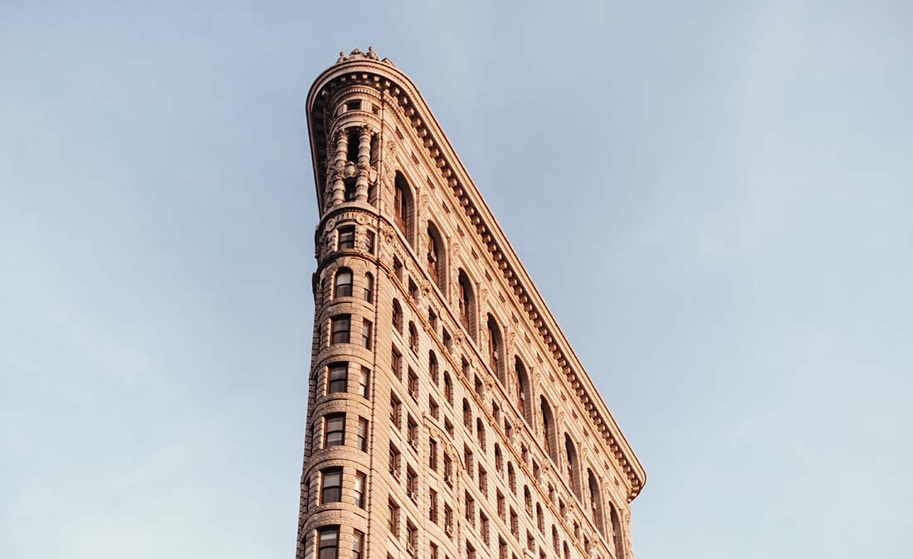
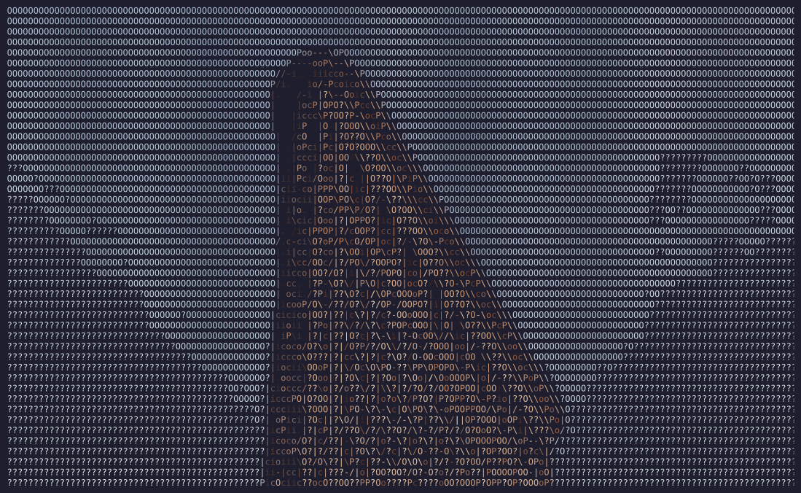
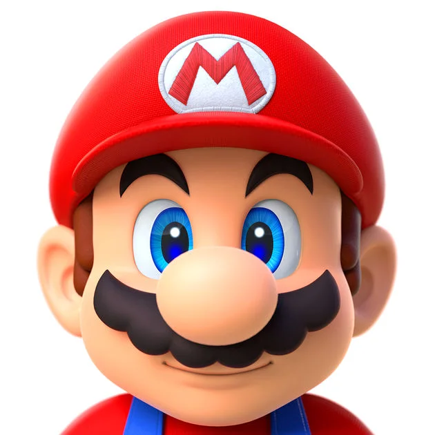
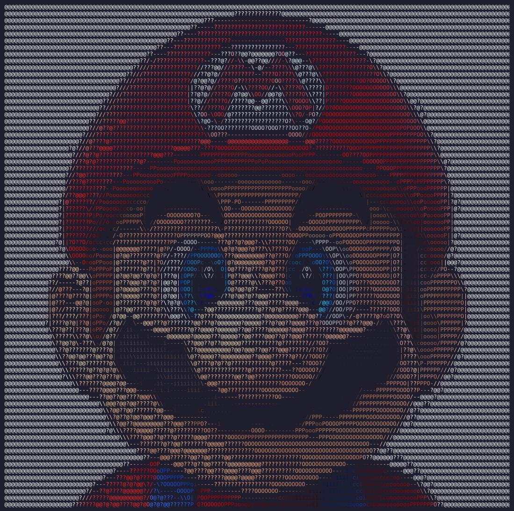
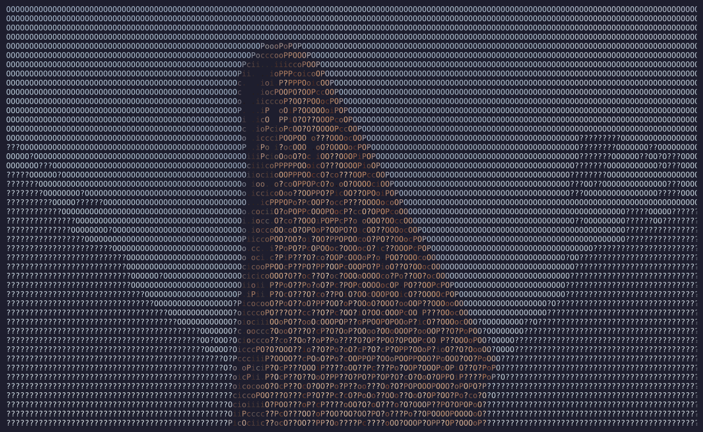
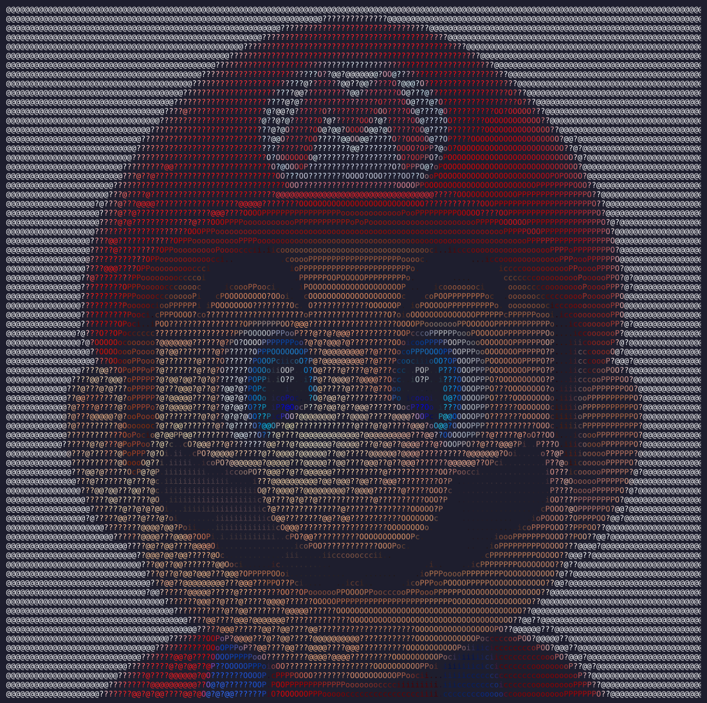

# image-2-ascii

This is a small image to ASCII art converter. Traditional ASCII art converters don't have any edge detection used to make out the outline of objects in the images. This code adds an extra edge detection layer to add contrast to objects in images. To accomplish this, a canny filter and a sobel filter are combined to extract the edges and identify the right ascii character to represent the edge based on the gradient found with the sobel filter. The edges are represented by the following characters `-`,`/`,`\`,`|` and the pixels intensities are represented with the following characters ` `, `.`, `i`, `c`, `o`, `P`, `O`, `?`, `@`.

This project was made in collaboration with [Edwin Lemelin](https://github.com/Edwin15571)

## Setup:

### Create a virtual envirment
```
python -m venv .venv
```

### Activate the environment:
- Command for Windows:
 ```
.venv\Scripts\activate
```

- Command for Linux/MacOS:
```
source .venv/bin/activate
```

#### 3) Install all the dependencies needed:
```
pip install -r requirements.txt
```


#### Info: 
Command to deactivate the virtual environment for windows/Linux/MacOS:
```
deactivate
```

## How to use:

```
python main.py --input_path --output_path --format --width --edge
```

- `--input_path`: Path to input video or image file (most file types supported)
- `--output_path`: Path to save the output file (required for 'image' or 'html' formats)
- `--format`: `terminal` (print to console), `image` (save as png), or `html` (save as webpage) (default: terminal)
- `--width`: Width of output in characters (default: 150)
- `--edge`: Enable or disable edge detection (default: True). Use `--no-edge` to disable


### Normal usage exemple:

```
python main.py -i ./images/flat_iron.png -f terminal
```

| Original Flat Iron                            | Ascii Flat Iron                                          |
|-----------------------------------------------|----------------------------------------------------------|
|  |  |


| Original Mario                        | Ascii Mario                                      |
|---------------------------------------|--------------------------------------------------|
|  |  |

### Results without edge detection:

#### Flat Iron:

```
python main.py -i ./images/flat_iron.png -f terminal --no-edge
```

| With edge detection                                      | Without edge detection                                            |
|----------------------------------------------------------|-------------------------------------------------------------------|
|  |  |

#### Mario:

```
python main.py -i ./images/mario.png -f terminal --no-edge
```

| With edge detection                              | Without edge detection                                    |
|--------------------------------------------------|-----------------------------------------------------------|
|  |  |


### Ascii art on video:

```
python main.py -i ./video/mario_clip.mp4 -o ./video/results/mario_clip_ascii.mp4 
```

For now only `.mp4` videos are supported. To view an exemple got to [./video/results](./video/results).

## References:

- https://www.youtube.com/watch?v=gg40RWiaHRY

- https://www.youtube.com/watch?v=t8aSqlC_Duo

